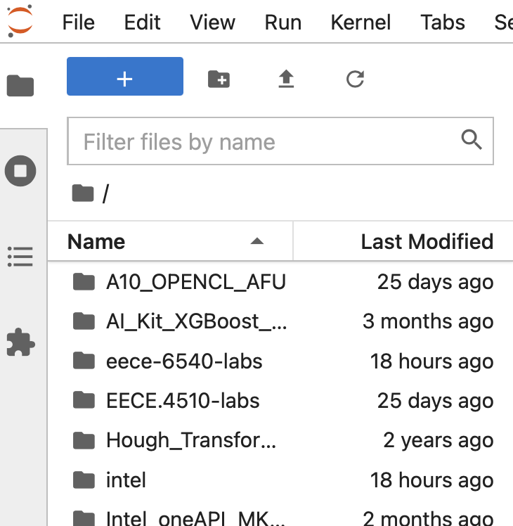

# EECE.4510/5510 Heterogeneous Computing - Lab 4

## Part 0: Lauch JupyterLab

In this lab, we use JupyterLab* to learn about how oneAPI can solve the challenges of programming in a heterogeneous world. Specicially we will learn about sub-groups to express parallelism. For EECE.5510 students, you will practice how to use Intel VTune tool to analyze the performance of your data parallel design and study ways to optimize it.

To launch JupyterLab, please follow this link and login using your credentials to Intel Developer Cloud.
[Launch JupyterLab on Intel DevCloud](https://jupyter.oneapi.devcloud.intel.com/hub/login?next=/lab/tree/Welcome.ipynb?reset).

Then you will need to navigate the "File Browser" to the left of your main Launcher page. You will start from your home directory and proceed to locate the top level of our lab repository that you checked out before.

Then you will navigate to "Labs/lab4" foler where you will see the jupyter notebooks from the File Browser panel.

Launch the appropriate jupyter notebook to work on Part 1: Sub-groups. EECE.5510 students will also need to work on Part 2: Profiling with Intel VTune.

## Part 1: Sub-groups

You will need to complete the exercises on sub-groups in the [Jupyter notebook](Sub_Groups.ipynb) Please note the questions raised in the notebook and answer them in your report. In addition, please take screenshots of your completed exercises and include them in your report as well.

## Part 2 [EECE.5510 Only]: Performance Evaluation using Intel VTune Profiler.

For EECE.5510 students, you also need to complete the exercises on Intel VTune Profiler in the [Jupyter notebook](Intel_VTune_Profiler.ipynb) Answer the questions and include the screenshots in your report.

