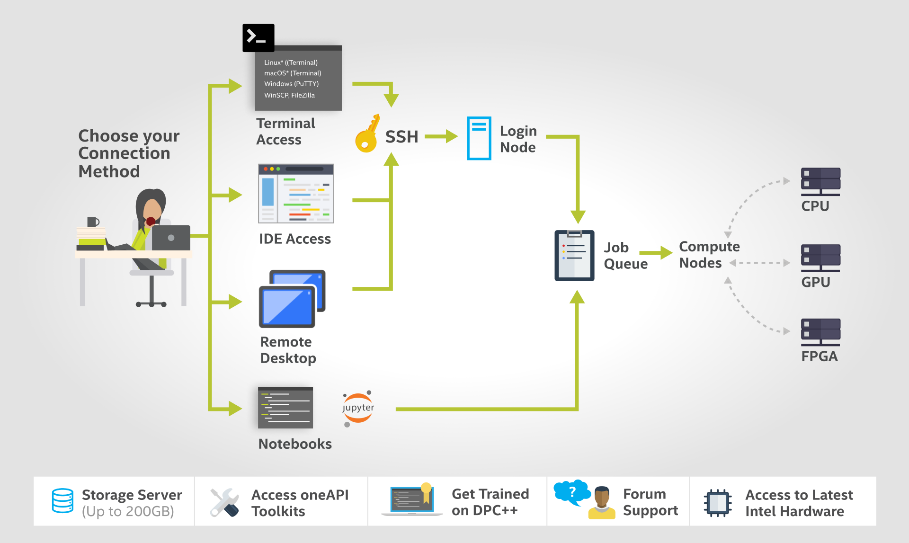

# eece-6540-labs
Labs and Exercises for EECE.4510/5510 (formerly EECE.6540) Heterogeneous Computing

This repository contains exercises and lab assignments for Heterogeneous Computing course. We leverage Intel Developer Cloud to learn oneAPI and DPC++ with heterogeneous computing resources including CPUs, FPGAs and GPUs. Both the hardware resources and development tools are evolving. Please check back frequently for updated information and sample code. Although it is the primary resource hub for EECE.4510/5510, this repository can be used by anyone who is interested in heterogeneous architectures and their applications.

## Apply for a free account on Intel Developer Cloud (DevCloud)

Intel Developer Cloud is a "development sandbox to learn about programming cross architecture applications with OpenVino, High Level Design (HLD) tools – oneAPI, OpenCL, HLS – and RTL." Students can apply for a free account to access the hardware resources and development tools. To apply, please visit:

https://devcloud.intel.com/oneapi/get_started/

## Methods to Access Intel DevCloud

There are several ways to access DevCloud as shown in the diagram: Terminal access, IDE access, Remote Desktop and Jupyter Notebooks.

(diagram source https://devcloud.intel.com/oneapi/ )

The following describes the detailed steps for accessing DevCloud through a terminal application, which is the preferred access mode for developing FPGA-oriented oneAPI applications.

## Set up SSH access to Intel DevCloud

Once you received login credentials from Intel DevCloud, please follow the instructions to setup SSH access to Intel DevCloud

https://github.com/intel/FPGA-Devcloud/tree/master/main/Devcloud_Access_Instructions#devcloud-access-instructions

## Set up lab environment on Intel DevCloud

You need to be able to SSH into DevCloud before proceeding with the following steps. DevCloud has two categories of "nodes": *Head Node* and *Compute Node*. The Head Node is the landing point once you login via SSH whereas a Compute Node is where the main code development work happens. The general principle is that you should only use Compute Nodes for development tasks (compilation, testing, debugging), so running any of these tasks on the Head Node is not supported and will lead to errors.

### On Head Node
Once you have set up the SSH key to access, you should be able to login the headnode (identified as "login-2").

First, you need to add the following lines to the end of your .bashrc file such that the later scripts can be found in your search path.
```
if [ -f /data/intel_fpga/devcloudLoginToolSetup.sh ]; then
    source /data/intel_fpga/devcloudLoginToolSetup.sh
fi
```

On the head node, you need to run the following command to select a compute node that supports OpenCL or OneAPI 

```
devcloud_login
```

For OpenCL labs please choose option 1)
```
1) Arria 10 PAC Compilation and Programming - RTL AFU, OpenCL
```
Then choose option 1) for OpenCL version 1.2.1
```
1) 1.2.1
```

For OneAPI labs please choose Option 2)
```
2) Arria 10 OneAPI
```

Either way, you will be directed to a compute node (identified as @s00x-nxxx) shortly. 

### On Compute Node
Then you will need to run the following command to set up the environment variables before compilation.

```
tools_setup
```
